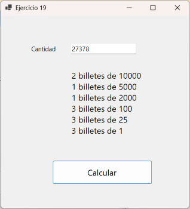
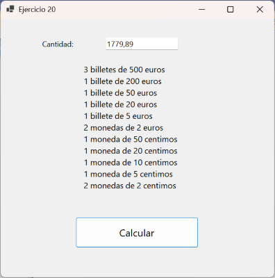
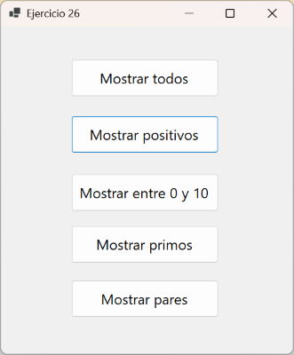

                                     

<br>

# Instrucciones generales

- **Entorno:** Visual Studio 2022 (Community). Proyectos Windows Forms y Consola en C#.
- **Alcance del Tema 4:** funciones y subprogramas, paso de parámetros, parámetros de entrada y de salida, argu-mentos por nombre y opcionales, funciones anónimas.
- **Estilo de código (Microsoft):**
  - Variables y parámetros: **camelCase** (p. ej., precioNeto).
  - Constantes/propiedades: **PascalCase** (p. ej., Iva, TipoCambio).
  - Controles en Forms: `txtNombre`, `lblResultado`, `btnCalcular`, etc.
  - Funciones: PascalCase (p. ej. CalcularPrecioTotal());
- **Buenas prácticas:**
  - Importes en `decimal` (sufijo m).
  - Parámetros fijos (IVA, retención) en `const`.
  - Salidas con **cadenas interpoladas** y **formato** (C2, P1, N0, …) cuando aplique.
  - **PascalCase** en nombre de funciones.


<br>

# Bloque A – Fundamentos. 

## Objetivo: Familiarizarnos con la sintaxis de las funciones.

## Ejercicio 1. Suma de dos números 

Realizar un programa de **Consola** que lea dos números y los sume, utilizando una función para realizar esa suma.

## Ejercicio 2. Número divisible entre otro 

Realizar un programa en **Consola** que lea 2 números y compruebe si el primero de esos núme-ros es divisible por el otro. Debemos hacer una función para hacer esa comprobación que tendrá la siguiente cabecera:

```csharp
bool EsDivisible(int num1, int num2)
```

## Ejercicio 3. Mayor de dos números. 

Realizar un programa de **Consola** que **lea dos números** y muestre por pantalla el **mayor** de esos dos números. En el caso que los números sean iguales mostrará cualquiera de los dos.

- 5 y 7 mostrará 7.
- 8 y 3 mostrará 8
- 20 y 20 mostrará 20
  
Tras cada introducción de números, preguntaremos al usuario si quiere volver a introducir números (S/N), repitiendo dicha introducción si pulsa S, o terminando el programa si pulsa N.

Realizar también la versión con **Windows Forms**.

## Ejercicio 4. Devolver Valor absoluto

Realizar una función en C# que **devuelva el valor absoluto** de un número entero. El programa principal leerá un número entero, llamará a la función Absoluto e imprimirá por pantalla el va-lor original del número y el valor de su absoluto. Realizar con **Consola**.

La cabecera de la función será:

```csharp
int DevolverAbsoluto(int num)
```

<br>

# Bloque B – Parámetros por Referencia (Entrada, Entrada/Salida y Salida)

## Ejercicio 5. Cambiar a Valor Absoluto.

Realizar una función en C# que **cambie el valor de un entero a su valor absoluto** a través de una función void. Realizar en **Consola**. 

La cabecera de la función será:
```csharp
void CambiarAbsoluto(ref int num)
```

Atención a las diferencias con el ejercicio anterior.

## Ejercicio 6. Intercambiar dos variables. 

Realizar un subprograma que **intercambie el valor** de 2 variables enteras. Hacer un programa que lea 2 números y visualice los valores intercambiados. 

La cabecera de la función será:
```csharp
void Intercambiar(ref int num1, ref int num2);
```

## Ejercicio 7. Devolver con out

Realiza un subprograma al que se le pasen dos números enteros (entrada) y devuelva el resulta-do de la suma, la resta y el producto de los dos números (salida). Realizar con **Windows Forms**.

## Ejercicio 8. Devolución con out y con return en la misma función. 

Realiza un **subprograma** al cuál se le pasen dos números enteros y **devuelva** mediante parámetros el resultado de la **división** y el **resto** entre los dos números (parámetros out). 

El subprograma devolverá un **booleano** mediante **return** que será true si se ha podido hacer la división o false si el divisor era cero. Realizar en **Consola**. 

<br>

# Bloque C – Funciones con bucles.

## Ejercicio 9. Lectura de entero con función

Realizar un subprograma en C# en el que utilizando `TryParse` el subprograma se mantenga en un bucle hasta que tengamos un número leído correcto y en ese momento lo devolvamos. Reali-zar la versión con **Consola**, y con **Windows Forms** (en este caso utilizando `InputBox`).
Solución Consola:

```csharp
static int LeerEntero(string mensaje)
{
    int num;
    bool correcto;

    do
    {
        Console.Write("Introduzca un número entero: ");
        // Si lo que leemos no es un entero devuelve false
        correcto = int.TryParse(Console.ReadLine(), out num);

        if(!correcto)
        {
            Console.WriteLine("El texto introducido no es un entero correcto.");
        }
            
    }while (!correcto);
    // Continuamos pidiendo el número mientras no sea correcto

    return num;
}

static void Main(string[] args)
{
    int num = LeerEntero("Introduzca un número entero: ");

    Console.WriteLine($"Este es el número introducido: {num}");
}
```


## Ejercicio 10. MCD

Realizar una función que calcule el **máximo común divisor** de dos números enteros. 

El máximo común divisor es el número más alto que divide a los dos números. 

Realizar versión **Windows Forms** y **Consola**.

- En la versión Forms podemos utilizar txtBoxes para leer los números.

- En la versión Consola podemos utilizar la función del ejercicio anterior para leer los números.

## Ejercicio 11. Nota Media.

Realizar un programa que lea 3 números por teclado correspondientes a las notas de las tres evaluaciones de un alumno. Realizar en **Consola**.

Tendremos una función para leer un `double` similar a la función del ejercicio 9 donde además de comprobar si lo que leemos es un `double` mediante `TryParse`, comprobaremos que la nota introducida está entre 0 y 10.

```csharp
double LeerDoubleEntre0y10()
```
Tendremos otra función a la cual se le pasen las tres nota leídas y nos devuelva la media de las mismas.

```csharp
double CalcularMedia(double nota1, double nota2, double nota3)
```

## Ejercicio 12. Potencia

Realizar un programa con una función que eleve un número a una potencia entera. Realizar con **Consola**

Utilizaremos programación modular, pasándole a la función la base y el exponente. 

Controlar con `TryCatch` (por ejemplo, utilizando una función de lectura similar a las de ejercicios anteriores) los errores de introducción de datos.

Controlar también el posible error de `OverFlow` en la potencia dentro del programa principal.

## Ejercicio 13. Llamadas a Potencia

Realizar un programa en el que se introduzca un número y nos calcule el resultado de elevar ese número **a 2, a 5 y a 7**. 

- Controlar posibles excepciones. 
- Utilizar **argumentos por nombre** en las llamadas a la función.

<br>

# Bloque D – Trabajamos con fechas y horas.

## Ejercicio 14. Año Bisiesto. 

Realiza una función que nos diga si un año es **bisiesto**. (Año bisiesto son los divisibles por 4 excepto los divisibles por 100 y no divisibles por 400).

[https://www.calendario-365.es/anos-bisiestos.html](https://www.calendario-365.es/anos-bisiestos.html)

## Ejercicio 15. Fecha Correcta.

Realiza una función que permita saber si **una fecha (dia, mes, año) es válida**. Ten en cuenta también los años bisiestos.

## Ejercicio 16. Un segundo después.

Realizar, utilizando ahora la **programación modular** y la **Consola**, el ejercicio que resolvimos en el tema anterior en el que introducimos una hora (**hora : minuto : segundo**), comprobamos que sea correcta y obtenemos la hora de un segundo después. 

- El ejercicio se realizará en **Consola**. 
  
- Tendremos una función (**HoraCorrecta**) para **comprobar** si una hora es correcta.
  
- El usuario **repetirá**, en el programa principal la introducción de la hora hasta que la hora introducida sea correcta.
  
- Tendremos una función (**HoraSiguiente**) con tres parámetros de entrada/salida (**ref**), en los que entrará la hora actual y devolveremos la hora de un segundo después.

## Ejercicio 17. Fecha Día Siguiente. (Entregar).

Realizar dos programas similares, en **Windows Forms** y en **Consola** que lean una fecha, comprueben **si es correcta**, y en ese caso, devuelvan la fecha del día siguiente.

- Podemos utilizar las funciones creadas en ejercicios anteriores.
  
- El ejercicio en **Windows Forms**, leerá, a través de textBoxes, la fecha. Si es correcta llamará a la función para obtener la fecha de un día después y la mostrará por pantalla.
  
- El ejercicio en *Consola*, pedirá al usuario que introduzca la fecha, repitiendo esta introducción hasta que sea correcta. A continuación,  mostrará la fecha del día siguiente.
  
## Ejercicio 18. DateTime.

Realiza el ejercicio anterior utilizando el tipo de dato `DateTime`. Para la validación de la fecha y el cálculo del día siguiente, deberás utilizar los métodos de la clase `DateTime`. Puedes consul-tar el **Anexo 4.1 DateTime** para obtener más información sobre cómo usar este tipo de dato y sus métodos asociados.

# Bloque E – Más Funciones.

## Ejercicio 19. Obtener Billetes (Ptas) 

Realizar el ejercicio 10 del tema 3 (aquel en el que a partir de una cantidad en pesetas obtenía-mos los billetes), **modularizando lo que se pueda**.

Podemos tener una **función a la que se le pasen las pesetas** y nos devuelva un texto con la lista de billetes.

También podemos tratar de modularizar **cada una de las partes** que calculaba cuantos billetes de una cantidad resultaban, haciendo una función que haga eso. 



 
## Ejercicio 20 Obtener billetes (Euros). (Entregar)

Realizar el ejercicio 11 del tema 3 (aquel en el que a partir de una cantidad en **euros** obteníamos los billetes y monedas correspondientes), modularizando lo que se pueda.

Realizar la versión en **Windows Forms** y la **versión Consola**
 


Tip: para obtener a partir de un valor decimal (768.89) los euros en una variable entera y los céntimos en otra lo podéis hacer así:

```csharp
  decimal cantidad = decimal.Parse(txtCantidad.Text);

  // Si tenemos 237.85 obtenemos 237 en euros y 85 en centimos
  int euros = (int)Math.Floor(cantidad);
  int centimos = (int)(cantidad * 100 - euros * 100);
```

## Ejercicio 21. Factorial.

Realizar un programa en **Consola** con una función que permita **calcular el factorial** de un número entero. El programa preguntará al usuario si desea volver a introducir otro número y se ejecutará hasta que el usuario responda que No.

Recordad que por ejemplo el **factorial** de 5 sería: **`5! = 5 * 4 * 3 * 2 * 1`**

## Ejercicio 22. División Entera

Realizar un programa con una función que permita calcular la **división entera** de un número entre otro mediante **restas sucesivas**.

**14 / 3 = 4** porque el número **3** lo puedo restar **4** veces a al **14**

## Ejercicio 23. Contar dígitos.

Realizar una función para determinar el **número de dígitos** de un número entero (ej. para la entrada “1244” se produce la salida “4”, para la entrada “13” se produce la salida “2”, etc.). 

Para realizar esta función podemos ir dividiendo el número entre 10 y contar cuantas veces lo dividimos hasta que nos quedamos sin número (0).

## Ejercicio 24. Calcular Serie (Entregar)

Realizar una función a la que se le pase dos enteros (m y n) y calcule el resultado de la siguien-te serie. 

m + m<sup>2</sup> / 2! + m<sup>3</sup> / 3! + m<sup>4</sup> / 4! + ….+m<sup>n</sup>/n!

Nuestro programa tendrá las siguientes funciones:

- `double CalcularFactorial(int num)`
  
- `double CalcularPotencia(int bbase, int exp)`
  
- `double CalcularSerie(int m, int n)`

# Bloque F – Funciones anónimas.

## Ejercicio 25. Validar Número.

Realizar un ejercicio en *Windows Forms* en el que validemos un número que el usuario introducirá mediante un `textBox`.

Tendremos una función que recibirá como parámetro la función que valida el número y será llamada dentro.

En distintos botones llamaremos a esa función pasándole por parámetro la función o funciones anónimas que nos sirvan para hacer la validación deseada.

Las validaciones serán:

- El número es positivo.
- El número está entre 0 y 10.
- El número es primo.
- El número es par.

## Ejercicio 26. Lambda e introducción a vectores.

Este ejercicio no hay que realizarlo. Simplemente sirve para introducir la utilización de vectores, que estudiaremos en el tema 6 y funciones lambda con ellos.

Realizar un ejercicio en el que tengamos un vector con unos valores enteros ya introducidos, y hagamos una función que devolverá un texto con los valores del vector que cumplan una deter-minada condición.

Esa condición vendrá dada por una función que se pasará por parámetros, y que luego llamare-mos con funciones delegadas, anónimas o lambda.




